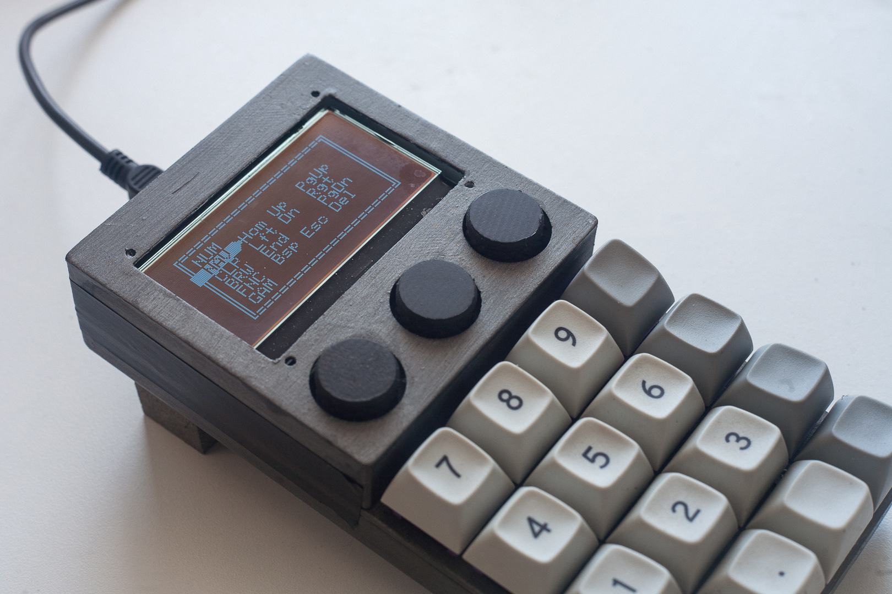
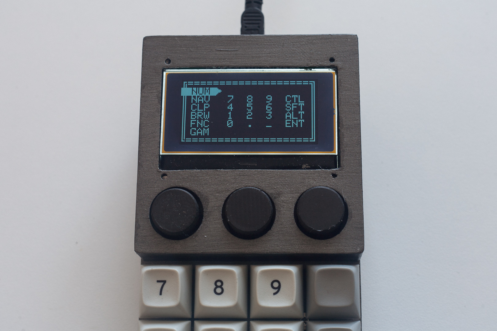

# numpad-lcd-encoders

## 📻 Project Description

A wired numberpad in 4×4 layout, with 3× rotary encoders, and a 128×64 LCD display.

## 🧰 Features

- 4×4 programmable keys
- 3× rotary encoders (rotate and click)
- 128×64 3.25" LCD display
- [KMK firmware](https://github.com/KMKfw/kmk_firmware)
- Micro-USB connector 

## 📐 Changes

- Changed from 5×3 layout to 4×3 layout
- Changed screen to `12864-WB-33V`
- Changed from standoff plates to enclosed shell
- Increased switch plate thickness from 1.5mm to 3.0mm
- Removed holes in bottom plate for trimpot/reset button

## ⏳ Issues

> ⚠ Not suitable for actual use. Use at your own risk!

- Spacing for switches is tight, to the point that the plate will warp and might snap (printer tolerances may vary)
- Top shell around screen can't be secured to rest of case
- Shell too tall for even 20mm rotary encoders

See: [Lessons Learnt Part 1](lessons1.md), [Part 2](lessons2.md), and [Part 3](lessons3.md)

## 🛒 Bill of Materials (BoM)

> ⚠ Bill still hasn't been updated

| Item | Size | Qty | Store |
| ---- | ---- | --- | ----- |
| Raspberry Pi Pico | N/A | 1 | [Raspberry official](https://www.raspberrypi.com/products/raspberry-pi-pico/)
| EC11 Rotary Encoder | ø6×20mm shaft | 3 | [Robotics.org.za](https://www.robotics.org.za/EC11-VER-20)
| LCD Display 128×64 | 93×70mm OD | 1 | [Robotics.org.za](https://www.robotics.org.za/12864-WH-33V)
| ~~LCD I2C Interface Module~~1 | N/A | ~~1~~ | [Robotics.org.za](https://www.robotics.org.za/6970622931577)
| Switches | MX | 15 |
| Diodes, 1N4148 | N/A | 18 |
| Standoffs | M3×10mm | 6 | [Robotics.org.za](https://www.robotics.org.za/M3-NYLON-KIT)
| Standoffs | M3×8mm | 4 |
| Standoffs | M3×6mm | 4 |
| Screws | M3×6mm | 6 |
| Screws | M2×?mm | 4 |
| Nuts | M3 | 6 |
| Nuts | M2 | 4 |
| 3D printed shell | N/A | 3 pcs |
| Encoder knobs | ø18×16mm | 3 pcs |
| JST-SH male breakout (optional) | JST-SH 6 pin | 4 pcs | [Robotics.org.za](https://www.robotics.org.za/4772), [Pololu](https://www.pololu.com/product/4772)
| JST-SH female connectors (optional) | JST-SH 6 pin | 4 pcs | [Robotics.org.za](https://www.robotics.org.za/JST-XH-6P-KIT) |

Notes:
1. I2C interface not required for the ST7565 controller version of the LCD board as it already utilises SPI.

---

## 🔗 References

- [KMK firmware](https://github.com/KMKfw/kmk_firmware)
- [Raspberry Pi Pico Datasheet](https://datasheets.raspberrypi.com/pico/pico-datasheet.pdf)
- [CircuitPython UF2 for Pico](https://circuitpython.org/board/raspberry_pi_pico/)