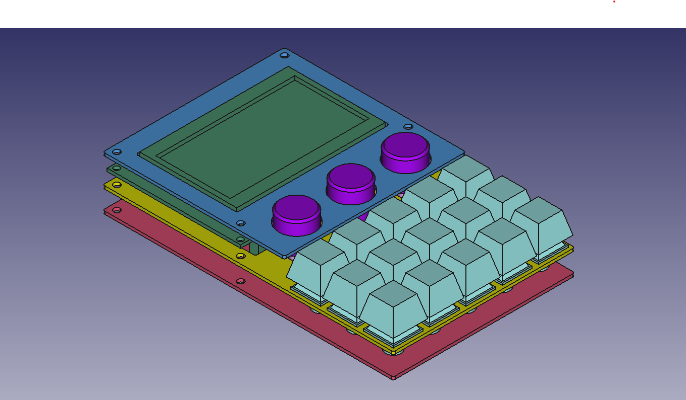
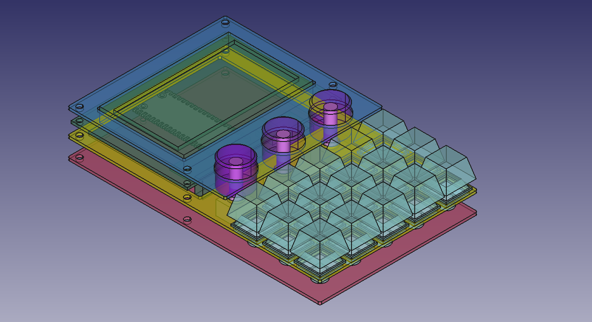

# numpad-lcd-encoders

## 📻 Project Description

A wired numberpad in 5×3 layout, with 3× rotary encoders, and a 128×64 LCD display.

## 🧰 Features

- 5×3 programmable keys
- 3× rotary encoders (rotate and click)
- 128×64 3.25" LCD display
- Micro-USB connector
- Cut-outs for MCU boot select switch, and trimpot for LCD brightness 

## ⏳ Issues

> ⚠ Current STL/FreeCAD models have not yet been tested!

- Awaiting on first print

## 🛒 Bill of Materials (BOM)

> ⚠ Dimensions for screws still to be finalised

| Item | Size | Qty | Store |
| ---- | ---- | --- | ----- |
| Raspberry Pi Pico | N/A | 1 | [Raspberry official](https://www.raspberrypi.com/products/raspberry-pi-pico/)
| EC11 Rotary Encoder | ø6×20mm shaft | 3 | [Robotics.org.za](https://www.robotics.org.za/EC11-VER-20)
| LCD Display 128×64 | 93×70mm OD | 1 | [Robotics.org.za](https://www.robotics.org.za/12864-WH-33V)
| LCD I2C Interface Module | N/A | 1 | [Robotics.org.za](https://www.robotics.org.za/6970622931577)
| Switches | MX | 15 |
| Diodes, 1N4148 | N/A | 18 |
| Standoffs | M3×10mm | 6 | [Robotics.org.za](https://www.robotics.org.za/M3-NYLON-KIT)
| Standoffs | M3×6mm | 8 |
| Screws | M3×6mm | 6 |
| Nuts | M3 | 6 |
| 3D printed shell | N/A | 3 pcs |
| Encoder knobs | ø18×16mm | 3 pcs |

---

## 🔗 References

- [KMK firmware](https://github.com/KMKfw/kmk_firmware)
- [Raspberry Pi Pico Datasheet](https://datasheets.raspberrypi.com/pico/pico-datasheet.pdf)
- [CircuitPython UF2 for Pico](https://circuitpython.org/board/raspberry_pi_pico/)