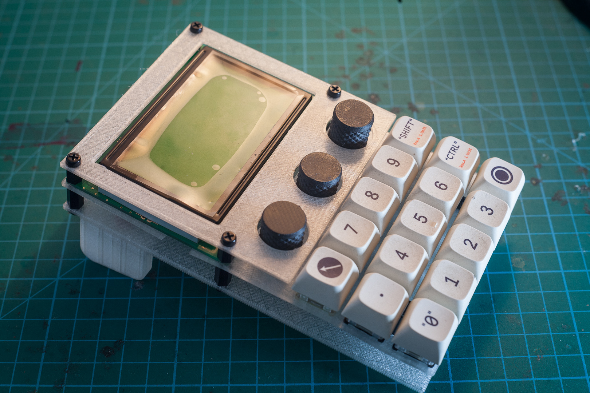
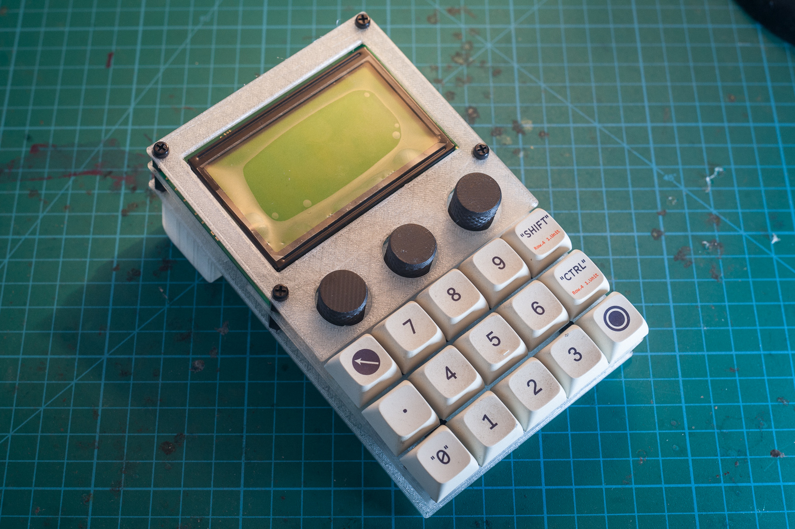
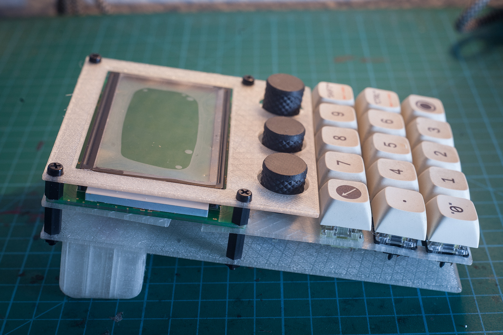
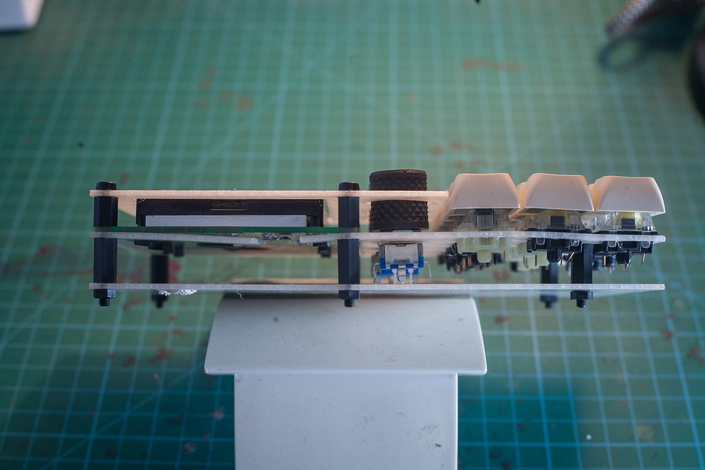
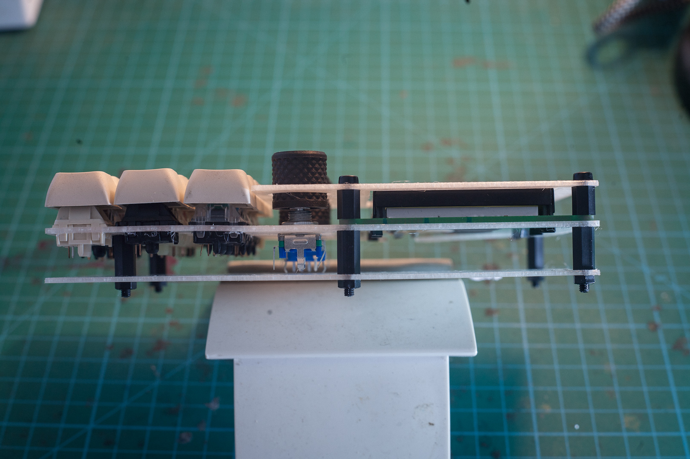
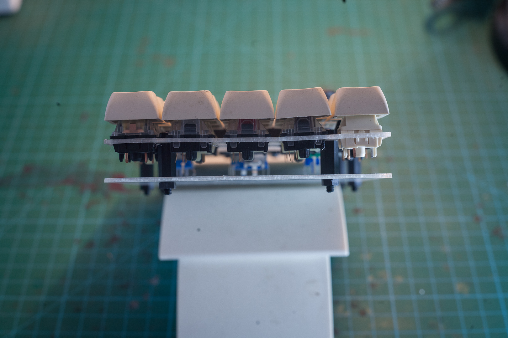
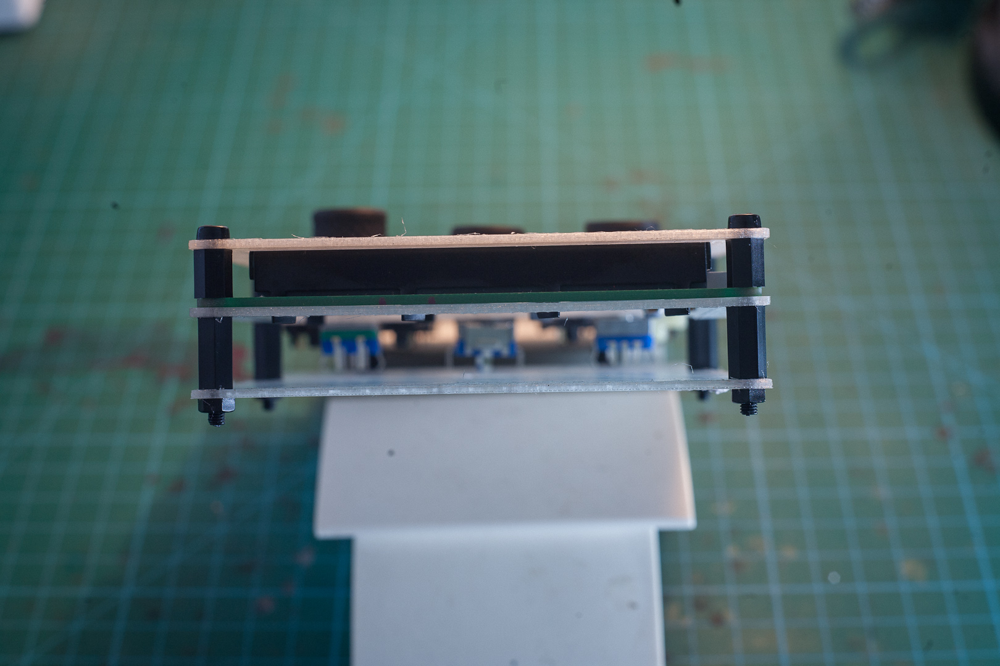
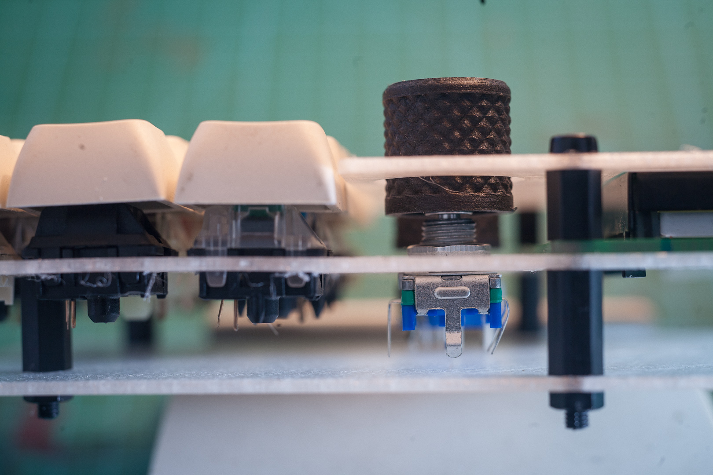
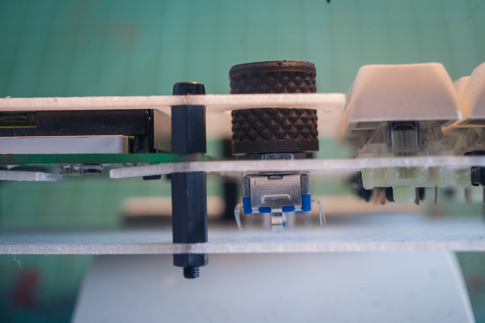
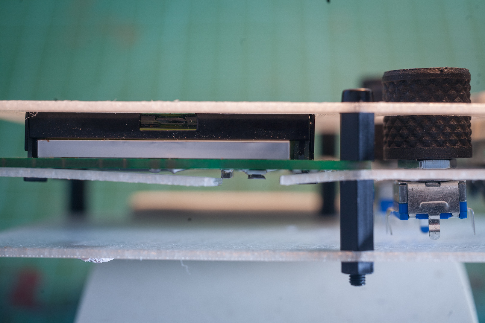

# Lessons Learnt Part 1

## Prototype 1

## Closeups

LHS section view. Pictured with 8mm and 12mm standoffs

RHS section view

Plate warping from bottom

VIew of plates from top - OK

Height of 16mm high knob on 20mm encoder versus plate

Height of 16mm high knob on 15mm encoder versus plate

Components below LCD PCB colliding with plate

# 🔗 Links:
 - [Lessons Learnt Part 2](lessons2.md)
 - [Readme](README.md)

---