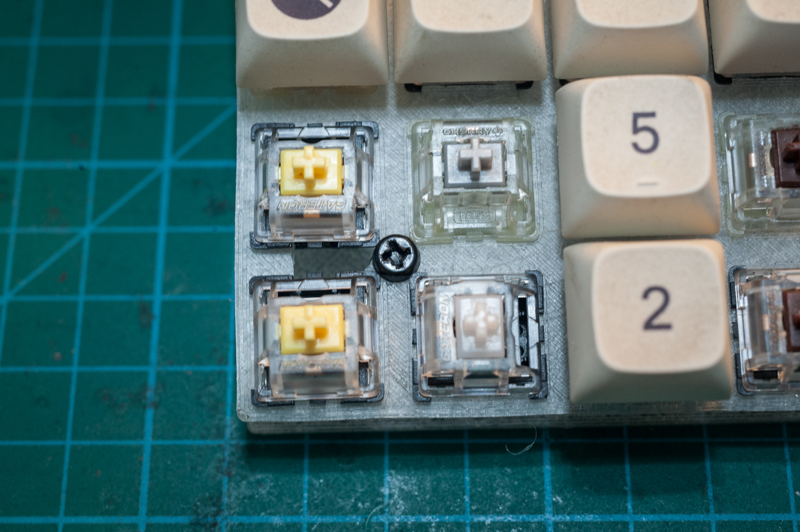

# Lessons Learnt Part 2

## Prototype 1

Broke the plate while trying to remove the knobs off the 15mm encoders in order to replace with 20mm encoders. The 3D printed knobs a
were extremely tight fits.

Please excuse the poor soldering - changing over to lead-free solder is proving a challenge. Note: This I2C interface board is not required when using ST7920 LCD displays.

Note the size of the screw heads versus the bottom flange on the switches.

Close up. These are M3 nylon screws.

Section view. About twice the height.

Close up of the dials on 20mm encoders. This is using 6mm + 8mm standoffs on the top plate.

# 🔗 Links:
 - [Lessons Learnt Part 1](lessons1.md)
 - [Lessons Learnt Part 3](lessons3.md)
 - [Readme](README.md)

---