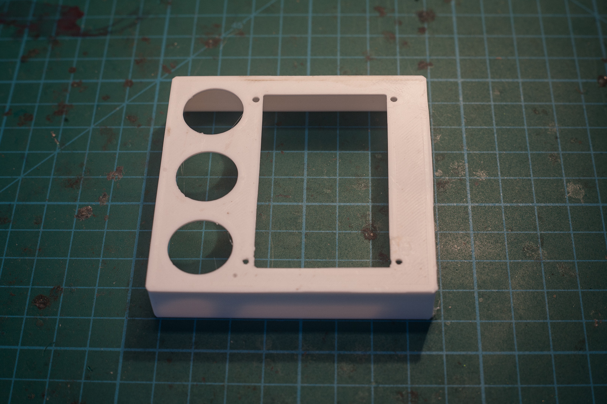
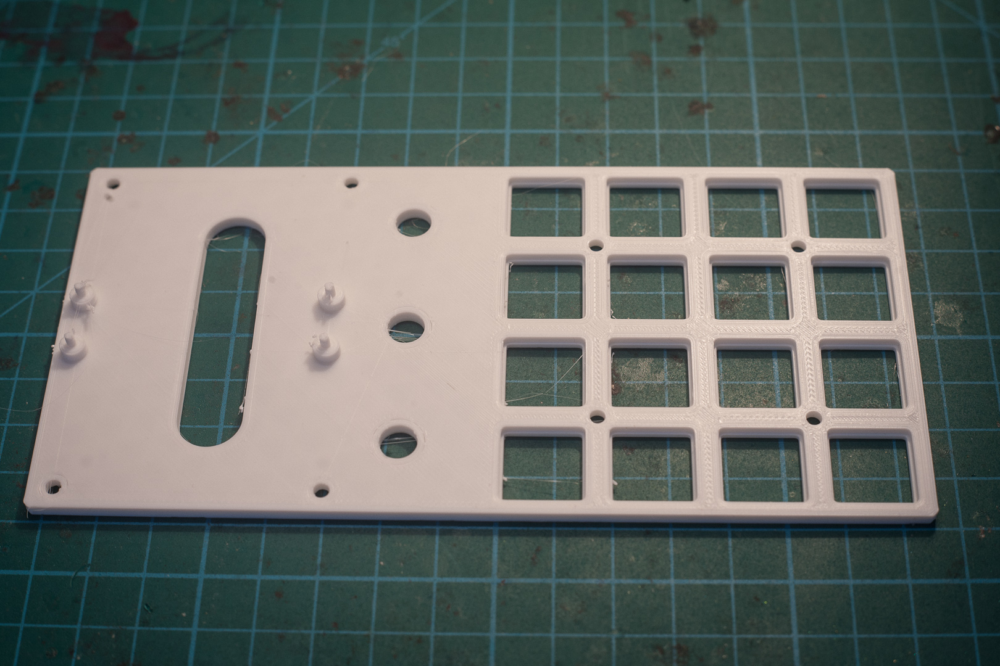
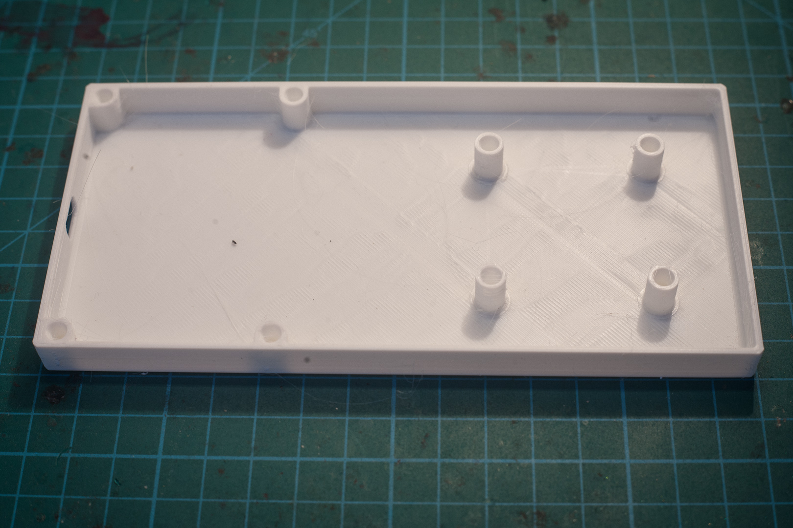
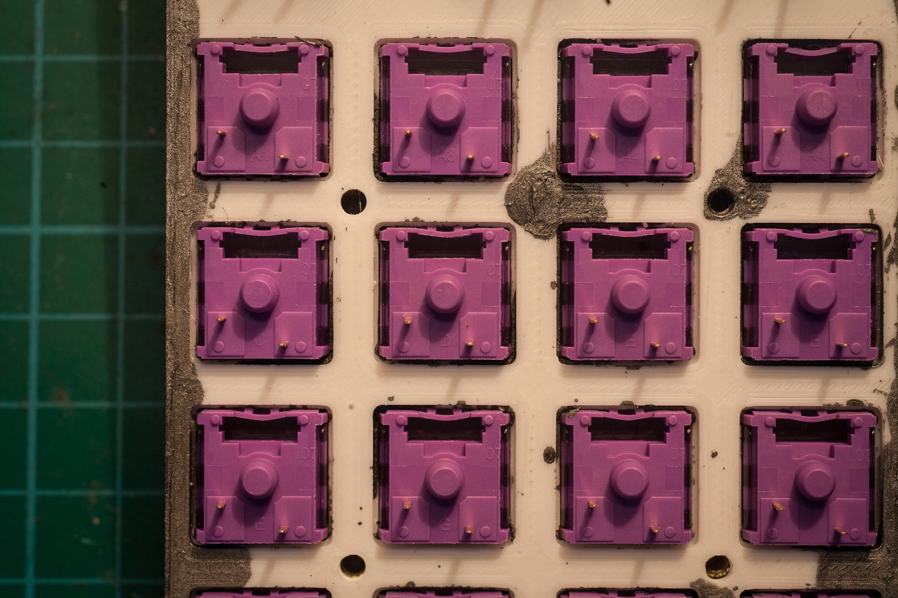
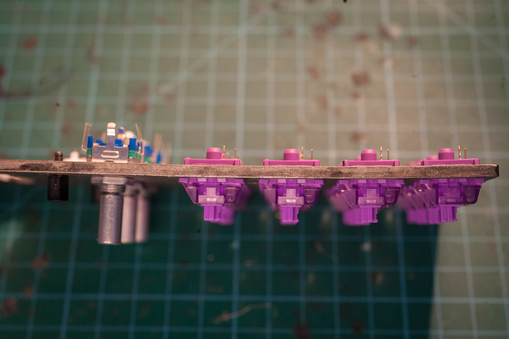
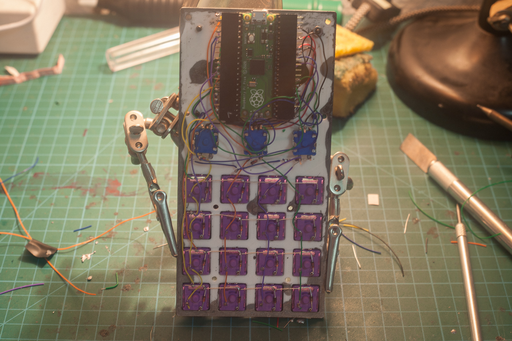
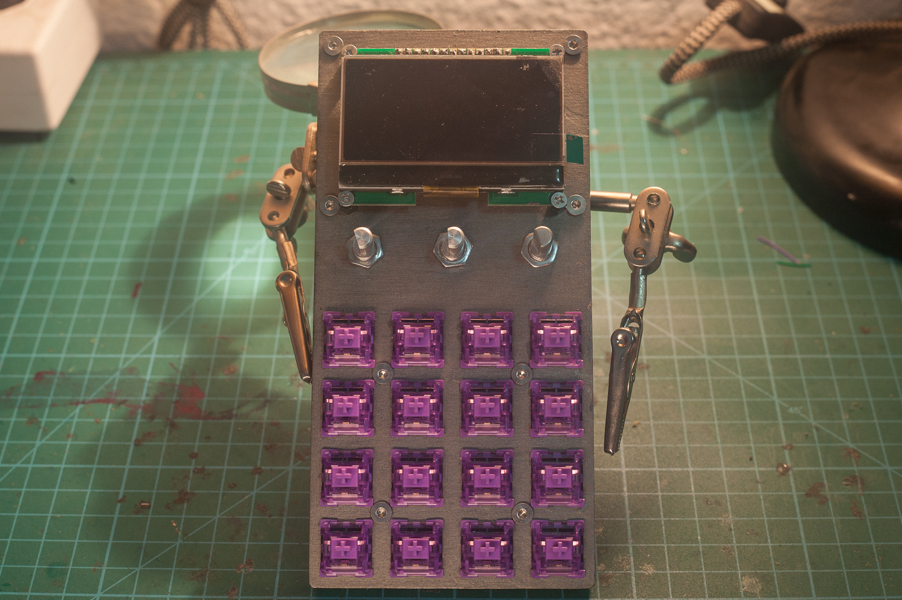
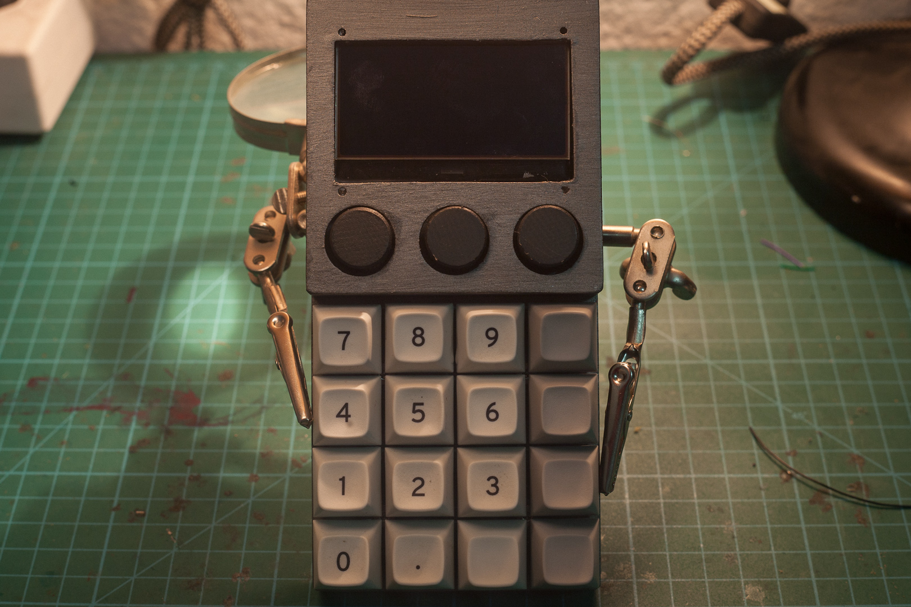
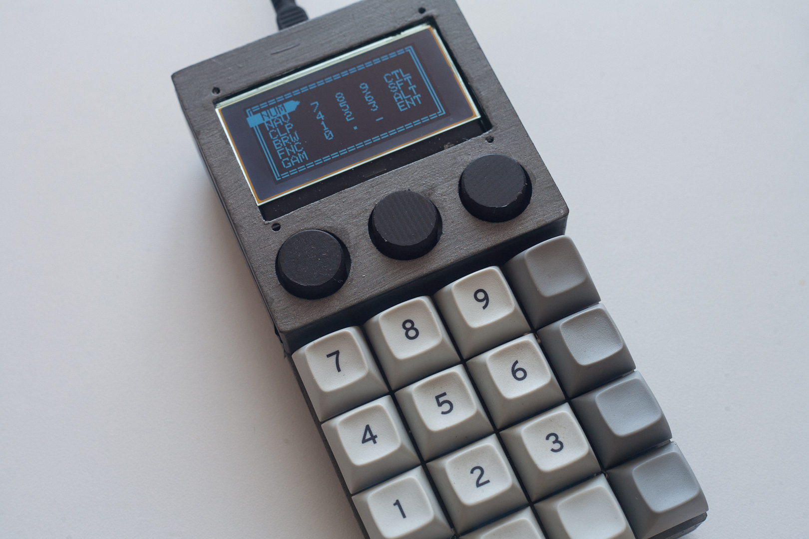
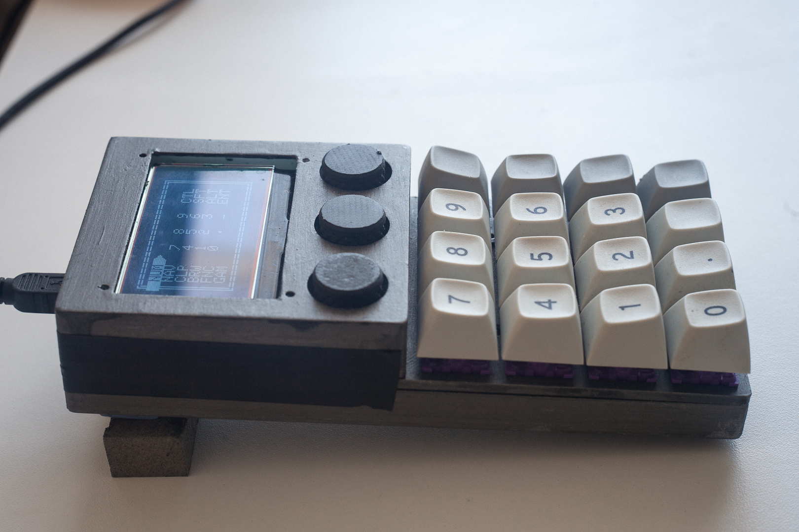

# Lessons Learnt Part 3

## Prototype 2

Top shell. Initial plan was to secure it with screws and standoffs to the LCD but the dimensions didn't work out.

Middle plate. Worked well, except for the pins to hold the MCU in place. These break off incredibly easily.

Bottom shell. Pilot fillet for the heat set inserts worked well. Though for the next build I'd rather place the walls on the middle insert, and have the bottom plate just be a flat plate with holes for screws.

Dimensions/tolerances for the cutouts for the switches were slightly off, you can see they're a bit too tight.

Plate warps slightly with all the switches installed, but not as badly as before.

Connected the components to the MCU with 90 degree SIL headers on the Pico, and soldering 30 AWG wire to female headers. Once everything is tested, the pins and joints are covered in insulation tape to prevent the wires moving and shorting neighbouring pins.

Screws fit snugly between the switches.

Cutouts around the rotary encoders are slightly off-center.

Window around the screen can be reduced to only the printable area of the LCD.

Top shell being held in place with insulation tape.

# 🔗 Links:
 - [Lessons Learnt Part 1](lessons1.md)
 - [Lessons Learnt Part 2](lessons2.md)
 - [Readme](README.md)

---